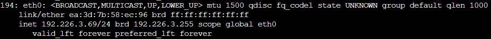
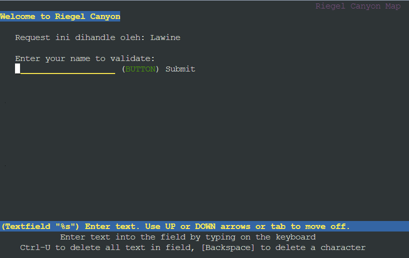
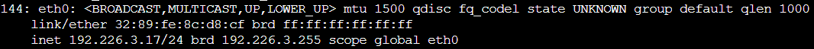
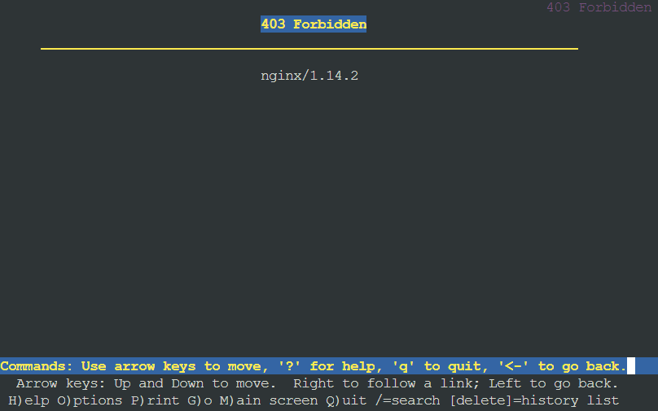
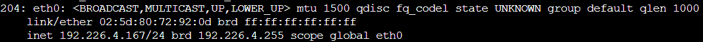
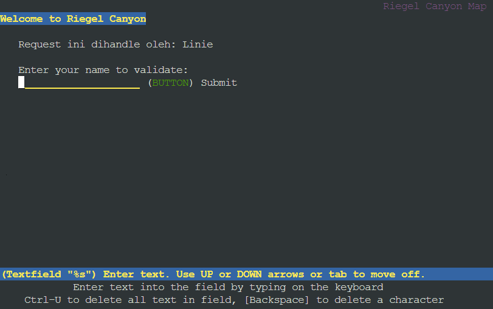
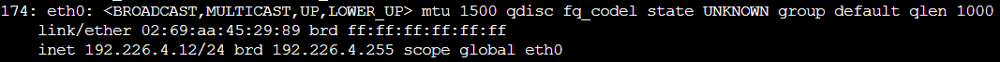
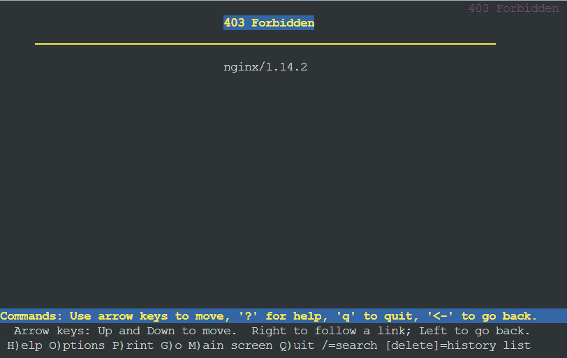

# Jarkom-Modul-3-F10-2023
Laporan resmi praktikum modul 3 dhcp &amp; reverse proxy mata kuliah jaringan komputer
Kelompok: F10 <br />
Nama anggota 1: Radhiyan M Hisan <br />
NRP anggota 1: 5025211166 <br />
Nama anggota 2: Thoriq Afif Habibi <br />
NRP anggota 2: 5025211154 <br />

## 11. Proxy passing untuk setiap request yang mengandung /its menuju https://its.ac.id
Untuk melakukakn proxy passing pada request yang mengandung '/its', perlu penambahan konfigurasi nginx lb-granz yang sudah dibuat dengan directive location '~ /its'. Block 'location ~ /its' akan menanggapi seluruh http request yang mengandung '/its', seperti 'home/its', '/its/index.php', '/home/its/xxx', dll. Selanjutnya, request tersebut harus dipassing ke `https://its.ac.id` dengan menggunakan fitur proxy_pass pada nginx. Block location yang ditambahkan pada konfigurasi adalah sebagai berikut:
```R
location ~ /its {
    proxy_pass https://www.its.ac.id;
}
```
### Testing
- lynx 192.226.2.2/home/its<br>
</img>

## 12. Pembatasan akses hanya untuk client dengan ip 192.226.3.69, 192.226.3.70, 192.226.4.167, 192.226.4.168
Pembatasan akses berdasarkan IP dapat dilakukan dengan menggunakan directive `allow` dan `deny` pada blok `location / {}`. Cara yang digunakan adalah dengan menspesifikasikan tiap IP yang diberikan hak akses dengan directive `allow IP`, lalu menolak akses IP lain dengan `deny all`. Berikut hasil modifikasi blok `location / {}` pada konfigurasi granz:
```R
location / {
    proxy_pass http://backend;
    proxy_set_header    X-Real-IP $remote_addr;
    proxy_set_header    X-Forwarded-For $proxy_add_x_forwarded_for;
    proxy_set_header    Host $http_host;

    allow 192.226.3.69;
    allow 192.226.3.70;
    allow 192.226.4.167;
    allow 192.226.4.168;
    deny all;

    auth_basic "Administrators Area";
    auth_basic_user_file /etc/nginx/rahasisakita/.htpasswd;
}
```
### Testing
- IP client: 192.226.3.69<br>


- IP client: 192.226.3.17


- IP client: 192.226.4.167


- IP client: 192.226.4.12



## 13. Database server pada Denken dan yang dapat diakses oleh worker laravel
Pengaturan database server dilakukan dengan beberapa langkah berikut:
1. Install mariadb-server pada `Denken` sebagain Database Server
2. Menambahkan `User` dan `Database` yang diperlukan program laravel
3. Menambahkan konfigurasi pada `/etc/mysql/my.cnf` agar dapat diakses oleh worker laravel
4. Menginstall mariadb-client pada 

## 14. Deployment Riegel Channel pada worker laravel

## 15. Testing POST request pada endpoint /auth/register

## 16. Testing POST request pada endpoint /auth/login

## 17. Testing GEt request pada endpoint /me

## 18. Proxy bind pada load balancer untuk mengaitkan IP tiap worker laravel

## 19. Implementasi PHP-FPM

## 20. Implementasi algoritma Least-conn