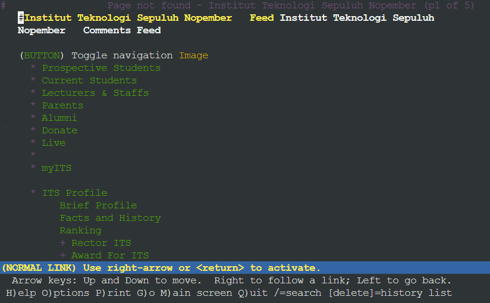
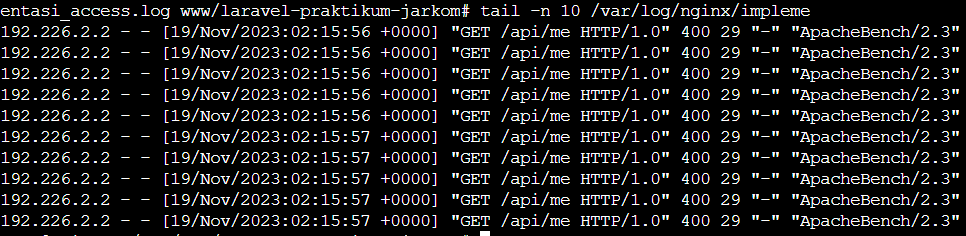

# Jarkom-Modul-3-F10-2023
Laporan resmi praktikum modul 3 dhcp &amp; reverse proxy mata kuliah jaringan komputer <br />
Kelompok: F10
Nama | NRP
--- | ---
Thoriq Afif Habibi | 5025211154
Radhiyan Muhammad Hisan | 5025211166

## 0. Register domain riegel.canyon.yyy.com untuk worker Laravel dan granz.channel.yyy.com untuk worker PHP mengarah pada worker yang memiliki IP [prefix IP].x.1
Mendaftarkan domain dilakukan di node DNS server, dalam modul ini adalah Heiter. Node yang IP-nya memenuhi kondisi untuk worker Laravel dan PHP masing-masing adalah Frieren dan Lawine:
```R
#!/bin/bash

zone="zone \"riegel.canyon.f10.com\" {
    type master;
    file \"/etc/bind/jarkom/riegel.canyon.f10.com\";
};


zone \"granz.channel.f10.com\" {
    type master;
    file \"/etc/bind/jarkom/granz.channel.f10.com\";
};"


echo "$zone" > /etc/bind/named.conf.local


mkdir /etc/bind/jarkom
cp /etc/bind/db.local /etc/bind/jarkom/riegel.canyon.f10.com


conf_riegel=';
; BIND data file for local loopback interface
;
$TTL    604800
@   IN  SOA riegel.canyon.f10.com. root.riegel.canyon.f10.com. (
            2022100601      ; Serial
            604800      ; Refresh
            86400           ; Retry
            2419200     ; Expire
            604800 )        ; Negative Cache TTL
;
@   IN  NS      riegel.canyon.f10.com.
@   IN  A       192.226.4.1     ; IP Frieren worker laravel
@   IN  AAAA        ::1'


echo "$conf_riegel" > /etc/bind/jarkom/riegel.canyon.f10.com


cp /etc/bind/db.local /etc/bind/jarkom/granz.channel.f10.com


conf_granz=';
; BIND data file for local loopback interface
;
$TTL    604800
@   IN  SOA granz.channel.f10.com. root.granz.channel.f10.com. (
            2022100601      ; Serial
            604800      ; Refresh
            86400           ; Retry
            2419200     ; Expire
            604800 )        ; Negative Cache TTL
;
@   IN  NS      granz.channel.f10.com.
@   IN  A       192.226.3.1     ; IP Lawine worker php
@   IN  AAAA        ::1'


echo "$conf_granz" > /etc/bind/jarkom/granz.channel.f10.com

service bind9 restart
```

## 1. Lakukan konfigurasi sesuai peta
Mengatur konfigurasi jaringan lewat _script_ yang dituliskan pada file **/etc/network/interfaces** di node masing-masing:
```R
# Aura
echo 'auto eth0
iface eth0 inet dhcp

auto eth1
iface eth1 inet static
	address 192.226.1.0
	netmask 255.255.255.0

auto eth2
iface eth2 inet static
	address 192.226.2.0
	netmask 255.255.255.0

auto eth3
iface eth3 inet static
	address 192.226.3.0
	netmask 255.255.255.0

auto eth4
iface eth4 inet static
	address 192.226.4.0
	netmask 255.255.255.0
' > /etc/network/interfaces

# Himmel
echo 'auto eth0
iface eth0 inet static
	address 192.226.1.2
	netmask 255.255.255.0
	gateway 192.226.1.0
' > /etc/network/interfaces

# Heiter
echo 'auto eth0
iface eth0 inet dhcp
hwaddress ether 42:32:8f:22:d8:58' > /etc/network/interfaces

# Denken
echo 'auto eth0
iface eth0 inet dhcp
hwaddress ether ba:63:50:e2:03:de' > /etc/network/interfaces

# Elsen
echo 'auto eth0
iface eth0 inet dhcp
hwaddress ether de:9f:53:b6:76:68' > /etc/network/interfaces

# Revolte
echo 'auto eth0
iface eth0 inet dhcp
hwaddress ea:3d:7b:58:ec:96' > /etc/network/interfaces

# Richter
echo 'auto eth0
iface eth0 inet dhcp' > /etc/network/interfaces

# Lawine
echo 'auto eth0
iface eth0 inet dhcp
hwaddress ether 9e:5e:1f:e6:c1:67' > /etc/network/interfaces

# Linie
echo 'auto eth0
iface eth0 inet dhcp
hwaddress ether c2:66:cc:96:7f:8e' > /etc/network/interfaces

# Lugner
echo 'auto eth0
iface eth0 inet dhcp
hwaddress ether 02:7e:1b:31:ee:b7' > /etc/network/interfaces

# Sein
echo 'auto eth0
iface eth0 inet dhcp
Hwaddress ether 02:5d:80:72:92:0d' > /etc/network/interfaces

# Stark
echo 'auto eth0
iface eth0 inet dhcp' > /etc/network/interfaces

# Frieren
echo 'auto eth0
iface eth0 inet dhcp
hwaddress ether 7a:a1:96:37:78:73' > /etc/network/interfaces

# Flamme
echo 'auto eth0
iface eth0 inet dhcp
hwaddress ether ce:d5:27:47:88:2c' > /etc/network/interfaces

# Fern
echo 'auto eth0
iface eth0 inet dhcp
hwaddress ether f2:94:c1:5b:15:fb' > /etc/network/interfaces
```

## 2. Client yang melalui Switch3 mendapatkan range IP dari [prefix IP].3.16 - [prefix IP].3.32 dan [prefix IP].3.64 - [prefix IP].3.80
Membuat konfigurasi agar perangkat yang tersambung melewati switch 3 mendapatkan alamat IP dengan jangkauan seperti yang tertera pada soal:
```R
echo 'INTERFACESv4="eth0"' > /etc/default/isc-dhcp-server

echo 'subnet 192.226.1.0 netmask 255.255.255.0 {
}

subnet 192.226.2.0 netmask 255.255.255.0 {
}

subnet 192.226.3.0 netmask 255.255.255.0 {
    range 192.226.3.16 192.226.3.32;
    range 192.226.3.64 192.226.3.80;
    option routers 192.226.3.0;
    option broadcast-address 192.226.3.255;
    option domain-name-servers 192.226.1.1;
    default-lease-time 180;
    max-lease-time 5760;
}

# ...

host Heiter {
    hardware ethernet 42:32:8f:22:d8:58;
    fixed-address 192.226.1.1;
}

host Denken {
    hardware ethernet ba:63:50:e2:03:de;
    fixed-address 192.226.2.1;
}

host Elsen {
    hardware ethernet de:9f:53:b6:76:68;
    fixed-address 192.226.2.2;
}

host Lawine {
    hardware ethernet 9e:5e:1f:e6:c1:67;
    fixed-address 192.226.3.1;
}

host Linie {
    hardware ethernet c2:66:cc:96:7f:8e;
    fixed-address 192.226.3.2;
}

host Lugner {
    hardware ethernet 02:7e:1b:31:ee:b7;
    fixed-address 192.226.3.3;
}

host Frieren {
    hardware ethernet 7a:a1:96:37:78:73;
    fixed-address 192.226.4.1;
}

host Flamme {
    hardware ethernet ce:d5:27:47:88:2c;
    fixed-address 192.226.4.2;
}

host Fern {
    hardware ethernet f2:94:c1:5b:15:fb;
    fixed-address 192.226.4.3;
}' > /etc/dhcp/dhcpd.conf

service isc-dhcp-server restart
```

## 3. Client yang melalui Switch4 mendapatkan range IP dari [prefix IP].4.12 - [prefix IP].4.20 dan [prefix IP].4.160 - [prefix IP].4.168
Menambahkan konfigurasi untuk switch 4 di file yang sama dengan no 2 yaitu **/etc/dhcp/dhcpd.conf**
```R
# ...
#     max-lease-time 5760;
# }

subnet 192.226.4.0 netmask 255.255.255.0 {
    range 192.226.4.12 192.226.4.20;
    range 192.226.4.160 192.226.4.168;
    option routers 192.226.4.0;
    option broadcast-address 192.226.4.255;
    option domain-name-servers 192.226.1.1;
    default-lease-time 720;
    max-lease-time 5760;
}

# host Heiter {
#     hardware ethernet 42:32:8f:22:d8:58;
# ...
```

## 4. Client mendapatkan DNS dari Heiter dan dapat terhubung dengan internet melalui DNS tersebut
Menambahkan DNS forwarder pada node DNS server, Heiter:
```R
echo 'options {
    directory "/var/cache/bind";


    forwarders {
        192.168.122.1;
    };


    allow-query{ any; };


    auth-nxdomain no;
    listen-on-v6 { any; };
};' > /etc/bind/named.conf.options
```

## 5. Lama waktu DHCP server meminjamkan alamat IP kepada Client yang melalui Switch3 selama 3 menit sedangkan pada client yang melalui Switch4 selama 12 menit. Dengan waktu maksimal dialokasikan untuk peminjaman alamat IP selama 96 menit
Pengalokasian waktu peminjaman alamat IP kepada Client oleh DHCP server diatur oleh perintah `default-lease-time` dan `max-lease-time` pada blok kode `subnet...` di file **/etc/dhcp/dhcpd.conf**:
```R
subnet 192.226.3.0 netmask 255.255.255.0 {
# ...
    default-lease-time 180;
    max-lease-time 5760;
}

subnet 192.226.4.0 netmask 255.255.255.0 {
# ...
    default-lease-time 720;
    max-lease-time 5760;
}
```

## 6. Pada masing-masing worker PHP, lakukan konfigurasi virtual host untuk website berikut dengan menggunakan php 7.3
Konfigurasi PHP worker Lawine, Linie, Lugner:
```R
cp /etc/nginx/sites-available/default /etc/nginx/sites-available/granz
wget -O '/var/www/granz.channel.f10.com.zip' 'https://drive.usercontent.google.com/download?id=1ViSkRq7SmwZgdK64eRbr5Fm1EGCTPrU1'
unzip /var/www/granz.channel.f10.com.zip -d /var/www
rm /var/www/granz.channel.f10.com.zip

echo 'server {
    listen 80 default_server;
    listen [::]:80 default_server;


    root /var/www/modul-3;


    index index.html index.htm index.php;


    server_name granz.channel.f10.com;


    location / {
        try_files $uri $uri/ =404;
    }


    location ~ \.php$ {
        include snippets/fastcgi-php.conf;


        fastcgi_pass unix:/run/php/php7.3-fpm.sock;
    }
}' > /etc/nginx/sites-available/granz

ln -s /etc/nginx/sites-available/granz /etc/nginx/sites-enabled
unlink /etc/nginx/sites-enabled/default

service nginx restart
```

Konfigurasi load balancer untuk granz:
```R
#!/bin/bash

cp /etc/nginx/sites-available/default /etc/nginx/sites-available/lb-granz
unlink /etc/nginx/sites-enabled/default
ln -s /etc/nginx/sites-available/lb-granz /etc/nginx/sites-enabled

echo 'upstream backend  {
    server 192.226.3.1; #IP Lawine
    server 192.226.3.2; #IP Linie
    server 192.226.3.3; #IP Lugner
}

server {
    listen 80 default_server;
    listen [::]:80 default_server;
    server_name _;

    location / {
        proxy_pass http://backend;
        proxy_set_header    X-Real-IP $remote_addr;
        proxy_set_header    X-Forwarded-For $proxy_add_x_forwarded_for;
        proxy_set_header    Host $http_host;
    }

    error_log /var/log/nginx/lb_error.log;
    access_log /var/log/nginx/lb_access.log;
}' > /etc/nginx/sites-available/lb-jarkom

service nginx restart
```

## 7. Setelah mengatur agar Eisen dapat bekerja maksimal sesuai _resource server_, lakukan testing dengan 1000 request dan 100 request/second
Server yang lebih bagus mendapat beban lebih (round robin dengan urutan weight dari terbesar Lawine, Linie, Lugner) <br >
Weight:
- Lawine: 4
- Linie: 2
- Lugner: 1

> Kode _testing_: `ab -n 1000 -c 100 http://192.226.2.2/`

## 8. Karena diminta untuk menuliskan grimoire, buatlah analisis hasil testing dengan 200 request dan 10 request/second masing-masing algoritma Load Balancer dengan ketentuan sesuai soal
Kode testing yang digunakan sama saja. Yang berbeda adalah algoritma _load balancer_ yang digunakan yang diatur di file konfigurasi node.

> Kode _testing_: `ab -n 200 -c 10 http://192.226.2.2/`

## 9. Dengan menggunakan algoritma Round Robin, lakukan testing dengan menggunakan 3 worker, 2 worker, dan 1 worker sebanyak 100 request dengan 10 request/second, kemudian tambahkan grafiknya pada grimoire
Jumlah worker diatur di blok kode `upstream backend...` pada konfigurasi _load balancer_ granz di file **/etc/nginx/sites-available/lb-jarkom**

> Kode _testing_: `ab -n 100 -c 10 http://192.226.2.2/`

## 10. Tambahkan konfigurasi autentikasi di LB dengan dengan kombinasi username: “netics” dan password: “ajkyyy”, dengan yyy merupakan kode kelompok. Terakhir simpan file “htpasswd” nya di /etc/nginx/rahasisakita/
```R
#!/bin/bash
mkdir /etc/nginx/rahasisakita
echo 'ajkf10' | htpasswd -ic /etc/nginx/rahasisakita/.htpasswd netics


echo 'upstream backend  {
    server 192.226.3.1 weight=4; #IP Lawine
    server 192.226.3.2 weight=2; #IP Linie
    server 192.226.3.3 weight=1; #IP Lugner
}


server {
    listen 80 default_server;
    listen [::]:80 default_server;
    server_name _;


    location / {
        proxy_pass http://backend;
        proxy_set_header    X-Real-IP $remote_addr;
        proxy_set_header    X-Forwarded-For $proxy_add_x_forwarded_for;
        proxy_set_header    Host $http_host;


        auth_basic "Administrators Area";
        auth_basic_user_file /etc/nginx/rahasisakita/.htpasswd;
    }


    location ~ /\.ht {
        deny all;
    }


    error_log /var/log/nginx/lb_error.log;
    access_log /var/log/nginx/lb_access.log;
}' > /etc/nginx/sites-available/lb-granz


service nginx restart
```

## 11. Proxy passing untuk setiap request yang mengandung /its menuju https://its.ac.id
Untuk melakukakn proxy passing pada request yang mengandung '/its', perlu penambahan konfigurasi nginx lb-granz yang sudah dibuat dengan directive location '~ /its'. Block 'location ~ /its' akan menanggapi seluruh http request yang mengandung '/its', seperti 'home/its', '/its/index.php', '/home/its/xxx', dll. Selanjutnya, request tersebut harus dipassing ke `https://its.ac.id` dengan menggunakan fitur proxy_pass pada nginx. Block location yang ditambahkan pada konfigurasi adalah sebagai berikut:
```R
location ~ /its {
    proxy_pass https://www.its.ac.id;
}
```
### Hasil Testing
- lynx 192.226.2.2/home/its<br>
</img>

## 12. Pembatasan akses hanya untuk client dengan ip 192.226.3.69, 192.226.3.70, 192.226.4.167, 192.226.4.168
Pembatasan akses berdasarkan IP dapat dilakukan dengan menggunakan directive `allow` dan `deny` pada blok `location / {}`. Cara yang digunakan adalah dengan menspesifikasikan tiap IP yang diberikan hak akses dengan directive `allow IP`, lalu menolak akses IP lain dengan `deny all`. Berikut hasil modifikasi blok `location / {}` pada konfigurasi granz:
```R
location / {
    proxy_pass http://backend;
    proxy_set_header    X-Real-IP $remote_addr;
    proxy_set_header    X-Forwarded-For $proxy_add_x_forwarded_for;
    proxy_set_header    Host $http_host;

    allow 192.226.3.69;
    allow 192.226.3.70;
    allow 192.226.4.167;
    allow 192.226.4.168;
    deny all;

    auth_basic "Administrators Area";
    auth_basic_user_file /etc/nginx/rahasisakita/.htpasswd;
}
```

### Hasil Testing
- IP client: 192.226.3.69<br>


- IP client: 192.226.3.17<br>


- IP client: 192.226.4.167<br>


- IP client: 192.226.4.12<br>


## 13. Database server pada Denken dan yang dapat diakses oleh worker laravel
Pengaturan database server dilakukan dengan beberapa langkah berikut:
1. Install mariadb-server pada `Denken` sebagain Database Server
2. Menambahkan `User` dan `Database` yang diperlukan program laravel
    ```R
    CREATE USER 'kelompokf10'@'%' IDENTIFIED BY 'passwordf10';
    CREATE USER 'kelompokf10'@'localhost' IDENTIFIED BY 'passwordf10';
    CREATE DATABASE dbkelompokf10;
    GRANT ALL PRIVILEGES ON *.* TO 'kelompokf10'@'%';
    GRANT ALL PRIVILEGES ON *.* TO 'kelompokf10'@'localhost';
    FLUSH PRIVILEGES;
    ```
3. Menambahkan konfigurasi pada `/etc/mysql/my.cnf` agar dapat diakses oleh worker laravel dan restart mysql service
    ```R
    [client-server]
    !includedir /etc/mysql/conf.d/
    !includedir /etc/mysql/mariadb.conf.d/

    [mysqld]
    skip-networking=0
    skip-bind-address
    ```
4. Menginstall mariadb-client pada ketiga worker laravel

### Hasil Testing


## 14. Deployment Riegel Channel pada worker laravel
Proses deployment aplikasi laravel pada tiap worker terdapat pada script <a href="https://github.com/SanGit56/Jarkom-Modul-3-F10-2023/blob/main/Fern/deploy.sh">deploy.sh</a> yang dilakukan dengan langkah-langkah berikut:
1. Instalasi php8.0, nginx, dan git
2. Melakukan clone pada resource <a href="https://github.com/martuafernando/laravel-praktikum-jarkom">laravel-praktikum-jarkom</a> serta lakukan composer update
    ```R
    cd /var/www/
    git clone https://github.com/martuafernando/laravel-praktikum-jarkom.git

    cd /var/www/laravel-praktikum-jarkom
    composer update --working-dir=/var/www/laravel-praktikum-jarkom
    composer install --working-dir=/var/www/laravel-praktikum-jarkom
    ```
3. Mengubah konfigurasi database pada `.env` lalu melakukan migrasi dan seed database pada program laravel
    ```R
    cp /var/www/laravel-praktikum-jarkom/.env.example /var/www/laravel-praktikum-jarkom/.env
    echo 'APP_NAME=Laravel
    APP_ENV=local
    APP_KEY=
    APP_DEBUG=true
    APP_URL=http://localhost

    LOG_CHANNEL=stack
    LOG_DEPRECATIONS_CHANNEL=null
    LOG_LEVEL=debug

    DB_CONNECTION=mysql
    DB_HOST=192.226.2.1
    DB_PORT=3306
    DB_DATABASE=dbkelompokf10
    DB_USERNAME=kelompokf10
    DB_PASSWORD=passwordf10

    BROADCAST_DRIVER=log
    CACHE_DRIVER=file
    FILESYSTEM_DISK=local
    QUEUE_CONNECTION=sync
    SESSION_DRIVER=file
    SESSION_LIFETIME=120

    MEMCACHED_HOST=127.0.0.1

    REDIS_HOST=127.0.0.1
    REDIS_PASSWORD=null
    REDIS_PORT=6379

    MAIL_MAILER=smtp
    MAIL_HOST=mailpit
    MAIL_PORT=1025
    MAIL_USERNAME=null
    MAIL_PASSWORD=null
    MAIL_ENCRYPTION=null
    MAIL_FROM_ADDRESS="hello@example.com"
    MAIL_FROM_NAME="${APP_NAME}"

    AWS_ACCESS_KEY_ID=
    AWS_SECRET_ACCESS_KEY=
    AWS_DEFAULT_REGION=us-east-1
    AWS_BUCKET=
    AWS_USE_PATH_STYLE_ENDPOINT=false

    PUSHER_APP_ID=
    PUSHER_APP_KEY=
    PUSHER_APP_SECRET=
    PUSHER_HOST=
    PUSHER_PORT=443
    PUSHER_SCHEME=https
    PUSHER_APP_CLUSTER=mt1

    VITE_PUSHER_APP_KEY="${PUSHER_APP_KEY}"
    VITE_PUSHER_HOST="${PUSHER_HOST}"
    VITE_PUSHER_PORT="${PUSHER_PORT}"
    VITE_PUSHER_SCHEME="${PUSHER_SCHEME}"
    VITE_PUSHER_APP_CLUSTER="${PUSHER_APP_CLUSTER}"' > /var/www/laravel-praktikum-jarkom/.env

    php artisan migrate:fresh
    php artisan db:seed --class=AiringsTableSeeder
    php artisan key:generate
    php artisan jwt:secret
    php artisan config:clear
    ```
4. Menambahkan konfigurasi nginx sebagai berikut
    ```R
    server {

        listen 80;

        root /var/www/laravel-praktikum-jarkom/public;

        index index.php index.html index.htm;
        server_name _;

        location / {
                try_files $uri $uri/ /index.php?$query_string;
        }

        # pass PHP scripts to FastCGI server
        location ~ \.php$ {
            include snippets/fastcgi-php.conf;
            fastcgi_pass unix:/var/run/php/php8.0-fpm.sock;
        }

        location ~ /\.ht {
            deny all;
        }

        error_log /var/log/nginx/implementasi_error.log;
        access_log /var/log/nginx/implementasi_access.log;
    }'
    ```
5. Restart service php8.0-fpm dan nginx

### Hasil Testing
Mengakses web Laravel dari client<br>


## 15. Testing POST request pada endpoint /auth/register
Untuk melakukan testing, diperlukan apache benchmark sebagai tools pada client. Kali ini, saya melakukan testing dari client `Sein`. POST request /auth/register membutuhkan data berupa username dan password sehingga saya membuat file `account.json` pada client terlebih dahulu sebagai berikut:
```R
{
    "username": "kelompokf10",
    "password": "passwordf10"
}
```

### Hasil Testing
Dengan file json tersebut, testing dapat dilakukan dengan `ab -n 100 -c 10 -p account.json -T application/json http://riegel.canyon.f10.com/api/auth/register`. Berikut hasil testing:
- Respon apache bencmark <br>
<br>
Pada hasil testing, terdapat 99 failed request karena saya melakukan testing register dengan username yang sama sehingga hanya yang pertama yang diterima.

- Log request pada worker<br>


- Perubahan database<br>


## 16. Testing POST request pada endpoint /auth/login
Untuk melakukan POST pada /auth/login, diperlukan data yang sama dengan pada /auth/register, yaitu username dan password. Maka, file `account.json` digunakan kembali untuk testing login. Di sini, saya mencoba melakukan testing dari client Revolte.

### Hasil Testing
Testing dapat dilakukan dengan `ab -n 100 -c 10 -p account.json -T application/json http://riegel.canyon.f10.com/api/auth/login`. Berikut hasil testing:
- Respon apache bencmark <br>
<br>

- Log request pada worker<br>


## 17. Testing GET request pada endpoint /me
Untuk melakukan request pada endpoint `/me`, diperlukan token yang didapatkan dari login. Karenanya, dilakukan request login terlebih dahulu lalu outputnya diletakkan pada `token.txt`. Token yang didapatkan tersebut digunakan untuk melakukan request GET ke `/me`. Berikut script yang digunakan untuk melakukan testing:
```R
curl -X POST -H "Content-Type: application/json" -d @account.json http://192.226.2.2:81/api/auth/login > token.txt
token=$(cat token.txt | jq -r '.token') 
ab -n 100 -c 10 -H "Authorization: Bearer $token" http://192.226.2.2:81/api/me
```

### Hasil Testing
- Respon apache benchmark <br>


- Log request pada worker <br>


## 18. Proxy bind pada load balancer untuk mengaitkan IP tiap worker laravel
Pada soal ini diminta agar worker pada riegel.channel dapat bekerja sama secara adil dan mengimplementasikan `proxy_bind`. Hal ini dapat dilakukan dengan mengimplementasikan load balancer dengan algoritma round robin karena algoritma ini akan meneruskan request satu per satu secara bergantian. Maka dibuat konfigurasi nginx lb-riegel pada load balancer (Eisen) yang berjalan di port 81 sebagai berikut:
```R
upstream backendRiegel {
    server 192.226.4.1;
    server 192.226.4.2;
    server 192.226.4.3;
}

server {
    listen 81 default_server;
    listen [::]:81 default_server;
    server_name _;

    location / {
        proxy_pass http://backendRiegel;
        proxy_bind 192.226.2.2;
        
        proxy_set_header    X-Real-IP $remote_addr;
        proxy_set_header    X-Forwarded-For $proxy_add_x_forwarded_for;
        proxy_set_header    Host $http_host;
    }

    error_log /var/log/nginx/lb_error.log;
    access_log /var/log/nginx/lb_access.log;
}
```
### Hasil Testing
Untuk memastikan apakah worker telah bekerja sama secara adil, dilakukan request endpoint `/me` sebanyak 30 request. Kemudian, dilihat log tiap worker apakah telah menerima jumlah request yang sama. Berikut hasil testing dengan `ab -n 30 http://192.226.2.2:81/api/me`
- Worker Frieren<br>


- Worker Flamme<br>


- Worker Fern<br>
<br>

Pada log request ketiga worker, terlihat bahwa ketiganya menerima jumlah request yang sama, yaitu 10 request. Hal ini menunjukkan bahwa worker telah bekerja sama secara adil.

## 19. Implementasi PHP-FPM
Pada php-fpm, kita dapat mengatur secara manual beberapa variabel pada file konfigurasi /etc/php/8.0/fpm/pool.d/www.conf berikut:
- max_children: Jumlah maksimal child process yang dapat dibuat
- start_servers: Jumlah awal child process ketika php-fpm berjalan
- min_spare_servers: Jumlah minimal idle child process pada php-fpm yang akan dibuat
- max_spare_servers: Jumlah maksimal idle child process pada php-fpm yang akan dibuat
Kami kemudian melakukan testing untuk melihat bagaimana variabel-variabel ini berpengaruh pada performa worker. Testing menggunakan apache benchmark dengan 100 request dan 10 request/second. Kami melakukan testing untuk 4 konfigurasi, dari default, penambahan1, penambahan2, dan penambahan3

### Hasil Testing
Kami melakukan testing dengan `ab -n 100 -c 10 http://192.226.2.2:81/`
- Default<br>
    max_children = 5<br>
    start_servers = 2<br>
    min_spare_servers = 1<br>
    max_spare_servers = 3<br>
    
- Penambahan1<br>
    max_children = 20<br>
    start_servers = 8<br>
    min_spare_servers = 4<br>
    max_spare_servers = 12<br>
    
- Penambahan2<br>
    max_children = 50<br>
    start_servers = 20<br>
    min_spare_servers = 10<br>
    max_spare_servers = 30<br>
    
- Penambahan3<br>
    max_children = 110<br>
    start_servers = 44<br>
    min_spare_servers = 22<br>
    max_spare_servers = 66<br>
    

Dari keempat pengaturan php-fpm, urutan pengaturan dengan kinerja terbaik berdasarkan rps adalah penambahan 2x, penambahan 2x, penambahan 1x, dan pengaturan default. Pengaturan penambahan 3x memberikan kinerja terbaik berdasarkan rps karena akan membuat child process yang banyak pada saat server menyala. Akan tetapi, pengaturan ini juga sebaiknya dilihat dari sisi sumber daya yang digunakan. Semakin tinggi penambahan yang digunakan, semakin tinggi pula sumber daya yang digunakan. Maka sebaiknya tidak hanya dinilai dari rps atau request per second.

## 20. Implementasi algoritma Least-conn
Untuk lebih meningkatkan lagi performa dari tiap worker, diimplementasikan algoritma leat_conn pada load balancer Eisen. Berikut script untuk mengimplementasikan algoritma ini:
```R
#!/bin/bash
echo 'upstream backendRiegel {
    least_conn;
    server 192.226.4.1;
    server 192.226.4.2;
    server 192.226.4.3;
}

server {
    listen 81 default_server;
    listen [::]:81 default_server;
    server_name _;

    location / {
        proxy_pass http://backendRiegel;
        proxy_bind 192.226.2.2;
        
        proxy_set_header    X-Real-IP $remote_addr;
        proxy_set_header    X-Forwarded-For $proxy_add_x_forwarded_for;
        proxy_set_header    Host $http_host;
    }

    error_log /var/log/nginx/lb_error.log;
    access_log /var/log/nginx/lb_access.log;
}' > /etc/nginx/sites-available/lb-riegel

service nginx restart
```

### Hasil Testing
Untuk melihat performa dari algoritma least_conn, dilakukan testing dengan `ab -n 100 -c 10 http://192.226.2.2/`. Berikut hasil testing:
<br>

Dari hasil testing tersebut, terlihat terdapat kenaikan rps ketika diimplementasikan algoritma least_conn. Oleh karena itu, least_conn terbukti berpengaruh terhadap kenaikan performa worker

## Catatan
Untuk hasil testing no 7 - 9 tersedia di grimoire. Tidak dicantumkan di README karena ada kendala dalam penyalinan dan pengunduhan file gambar. Diakali dengan tangkap layar tidak cukup berkualitas resolusinya.